# Technical Report — Hardware-Telemetry-Based Ransomware Detection with TinyML

A machine-learning pipeline for **binary ransomware detection from hardware/system telemetry**, followed by **TensorFlow Lite conversion and C-header export** for embedded or edge deployment.

The project emphasizes not only classifier training, but also **data-quality analysis, exploratory data analysis (EDA), validation, error analysis, cross-validation, and deployment parity testing**.

> **Important result interpretation:** the current dataset contains very strong class separation. Several individual features can independently separate the two classes with ROC-AUC ≈ 1.0. Therefore, the reported perfect test performance should be interpreted primarily as validation of the end-to-end ML/TinyML pipeline, **not as evidence of universal real-world ransomware generalization**.

---

## 1. Project Overview

The classifier uses eight telemetry features:

| Feature | Meaning |
|---|---|
| `USB_V` | USB voltage |
| `USB_A` | USB current |
| `USB_W` | USB power |
| `Int_Accel` | Internal acceleration |
| `Ext_Accel` | External acceleration |
| `Net_Traffic` | Network traffic |
| `RF_Density` | RF-density measurement |
| `Sys_Temp` | System temperature |

The target label is binary:

- `0` → Normal
- `1` → Ransomware

The executed notebook contains **3,000 samples**:

- **1,650 Normal (55%)**
- **1,350 Ransomware (45%)**
- **0 missing values**
- **0 duplicate rows**

Dataset:  
https://www.kaggle.com/datasets/swastiksingh123/ransomware-hardware

---

## 2. End-to-End Pipeline

```text
Hardware/System Telemetry
          │
          ▼
 Dataset Quality Audit
          │
          ▼
 Exploratory Data Analysis
 ├── Class distribution
 ├── Descriptive statistics
 ├── Histograms
 ├── Boxplots
 ├── Correlation analysis
 ├── Single-feature separability
 └── PCA
          │
          ▼
 Stratified Data Split
  Train / Validation / Test
          │
          ▼
 TensorFlow Neural Network
 Normalization → Dense(64)
 → Dropout → Dense(32)
 → Dropout → Sigmoid
          │
          ▼
 Model Evaluation
 ├── Accuracy / Precision / Recall / F1
 ├── ROC-AUC / PR-AUC
 ├── Confusion matrix
 ├── Threshold analysis
 ├── Error analysis
 └── 5-fold stratified CV
          │
          ▼
 TinyML Conversion
 TensorFlow → Float16 TFLite
          │
          ▼
 Keras ↔ TFLite Parity Check
          │
          ▼
 C Header Export
```

---

## 3. Dataset Quality Analysis

The notebook first validates the dataset before any training.

### Dataset integrity

| Check | Result |
|---|---:|
| Rows | 3,000 |
| Columns | 9 |
| Missing values | 0 |
| Duplicate rows | 0 |
| Normal samples | 1,650 |
| Ransomware samples | 1,350 |

The label balance is sufficiently close to balanced for binary classification, although the original pipeline retains class weighting.

### Class distribution

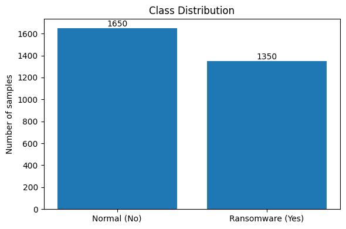

---

## 4. Exploratory Data Analysis

### 4.1 Feature distributions

The class-wise histograms show large shifts between Normal and Ransomware observations across most telemetry variables.

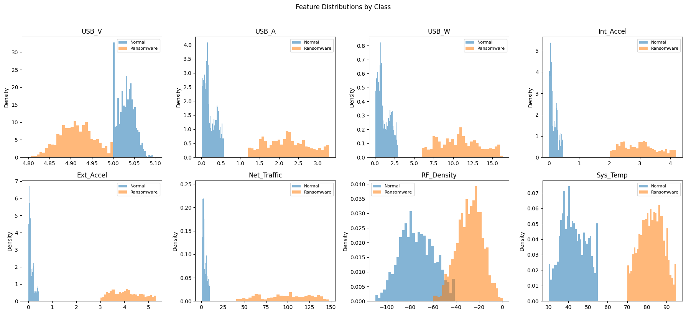

The distributions indicate that ransomware observations tend to have:

- higher USB current and power,
- higher internal and external acceleration,
- higher network traffic,
- higher RF density,
- substantially higher system temperature,
- slightly lower USB voltage.

### 4.2 Boxplot analysis

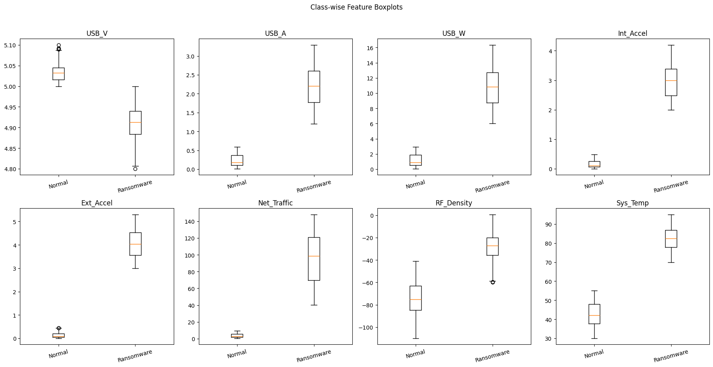

The boxplots reinforce the same pattern and make the limited overlap between the two classes visually obvious.

---

## 5. Correlation and Feature Redundancy

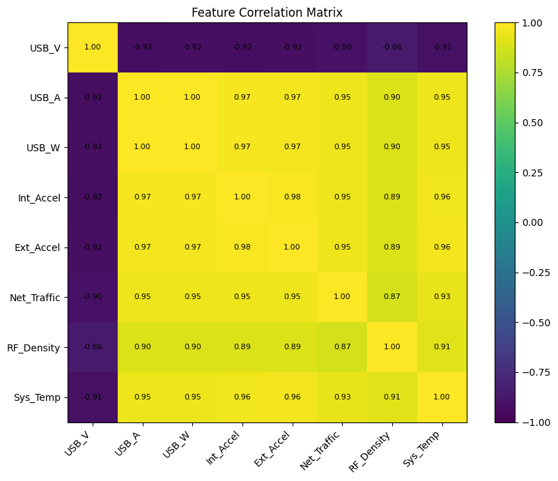

Several input features are strongly correlated.

Notable correlations from the executed notebook include:

| Feature pair | Correlation |
|---|---:|
| `USB_A` ↔ `USB_W` | 0.9999 |
| `Int_Accel` ↔ `Ext_Accel` | 0.9813 |
| `Ext_Accel` ↔ `Sys_Temp` | 0.9639 |
| `Int_Accel` ↔ `Sys_Temp` | 0.9609 |
| `USB_A` ↔ `Int_Accel` | 0.9706 |
| `USB_V` ↔ `USB_A` | -0.9239 |

The nearly perfect `USB_A`–`USB_W` correlation is expected to contain redundant information because electrical power is physically related to voltage and current.

This means the model has multiple highly predictive and partially redundant signals available simultaneously.

---

## 6. Single-Feature Separability

A dedicated diagnostic measures the ROC-AUC obtained from **each feature individually**.

| Feature | Single-feature ROC-AUC | Direction |
|---|---:|---|
| USB_A | 1.000000 | higher → ransomware |
| USB_W | 1.000000 | higher → ransomware |
| Int_Accel | 1.000000 | higher → ransomware |
| Ext_Accel | 1.000000 | higher → ransomware |
| Sys_Temp | 1.000000 | higher → ransomware |
| Net_Traffic | 1.000000 | higher → ransomware |
| USB_V | 0.999169 | lower → ransomware |
| RF_Density | 0.994968 | higher → ransomware |

The range-overlap diagnostic gives even stronger evidence:

| Feature | Normal range | Ransomware range | Range overlap |
|---|---|---|---|
| USB_A | 0.0100–0.5850 | 1.2000–3.2920 | No |
| USB_W | 0.0500–2.9510 | 6.0000–16.3380 | No |
| Int_Accel | 0.0000–0.4799 | 2.0000–4.1952 | No |
| Ext_Accel | 0.0000–0.4477 | 3.0021–5.2974 | No |
| Sys_Temp | 30.0–55.0 | 70.0–95.0 | No |
| Net_Traffic | 0.5000–9.6260 | 40.3570–147.9400 | No |
| USB_V | 5.0000–5.1000 | 4.8000–5.0000 | Yes |
| RF_Density | -110.0–-41.0 | -60.0–0.6 | Yes |

### Interpretation

This is the most important limitation of the dataset.

The task is **nearly trivial from several single features**, so perfect neural-network performance is not surprising. The result should not be described as proof that the detector will achieve 100% performance on arbitrary real-world ransomware.

---

## 7. PCA Analysis

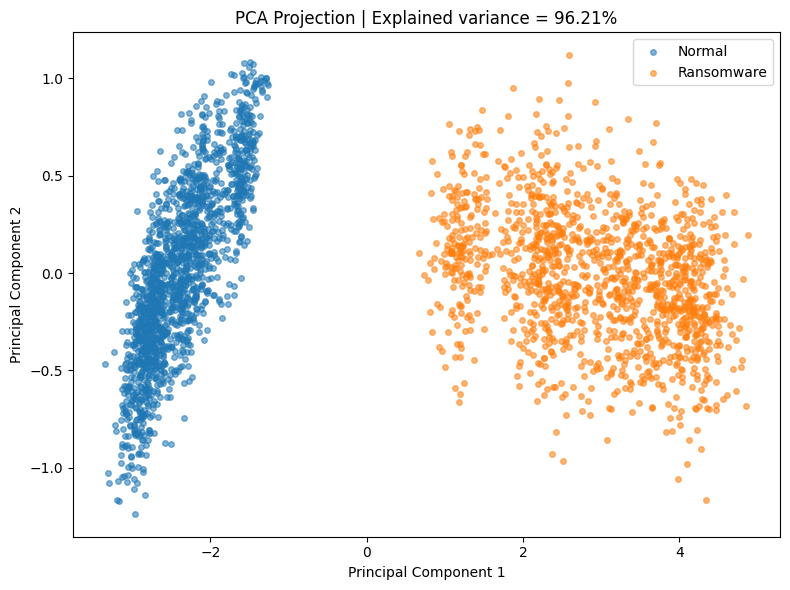

After standardization, the first two principal components explain approximately:

- **PC1:** 94.18%
- **PC2:** 2.04%

Together they explain roughly **96.21%** of the variance.

The PCA visualization shows that much of the class structure can be represented in a very low-dimensional space, again supporting the finding that the dataset is strongly separable.

---

## 8. Data Splitting Strategy

A stratified split preserves class proportions.

| Split | Samples | Normal | Ransomware |
|---|---:|---:|---:|
| Train | 2,099 | 1,154 | 945 |
| Validation | 451 | 248 | 203 |
| Test | 450 | 248 | 202 |

Normalization statistics are learned **only from the training set**, reducing preprocessing leakage.

---

## 9. Neural-Network Architecture

The TensorFlow/Keras classifier is deliberately compact.

```text
Input: 8 telemetry features
        │
        ▼
Normalization
        │
        ▼
Dense(64, ReLU)
        │
        ▼
Dropout(0.30)
        │
        ▼
Dense(32, ReLU)
        │
        ▼
Dropout(0.30)
        │
        ▼
Dense(1, Sigmoid)
        │
        ▼
Ransomware probability
```

### Model configuration

| Parameter | Value |
|---|---:|
| Trainable architecture | 8 → 64 → 32 → 1 |
| Total parameters | 2,706 |
| Approx. raw parameter storage | 10.57 KB |
| Optimizer | Adam |
| Learning rate | 0.001 |
| Loss | Binary cross-entropy |
| Dropout | 0.30 |
| L2 regularization | 0.0001 |
| Batch size | 32 |
| Maximum epochs | 150 |
| Early-stopping patience | 15 |
| Deployment threshold | 0.45 |

The normalization layer adds 17 non-trainable parameters; the model has 2,689 trainable parameters.

---

## 10. Class Weighting

The training pipeline uses:

```text
Normal     = 0.909445
Ransomware = 1.110582
```

These weights mildly compensate for the 55:45 class distribution.

---

## 11. Training Behaviour

Training stopped after **16 epochs** and restored the weights from **epoch 1**, because validation ROC-AUC had already reached 1.0.

At the selected epoch:

- Train ROC-AUC: **0.990986**
- Validation ROC-AUC: **1.000000**
- Same-epoch AUC gap: **-0.009014**

### Loss curve

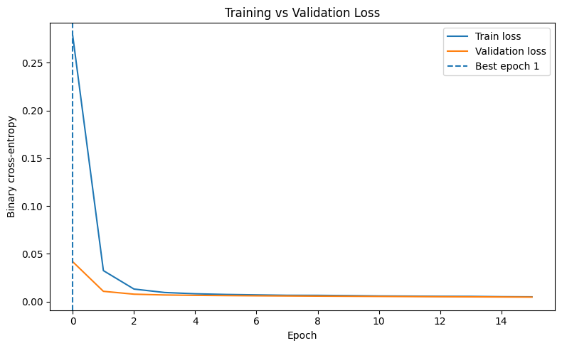

### ROC-AUC curve

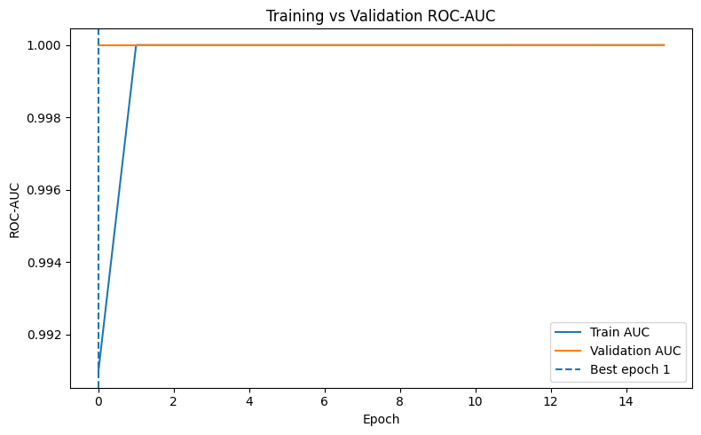

The immediate validation saturation is consistent with the EDA result that the classes are extremely easy to separate.

---

## 12. Held-Out Test Performance

The final classifier was evaluated on a test set that was not used for fitting.

| Metric | Result |
|---|---:|
| Accuracy | 1.0000 |
| Precision | 1.0000 |
| Recall | 1.0000 |
| F1-score | 1.0000 |
| ROC-AUC | 1.0000 |
| PR-AUC | 1.0000 |
| False-positive rate | 0.0000 |
| False-negative rate | 0.0000 |

Confusion matrix:

```text
                 Predicted
               Normal  Ransomware
Actual Normal     248       0
Actual Ransom       0     202
```

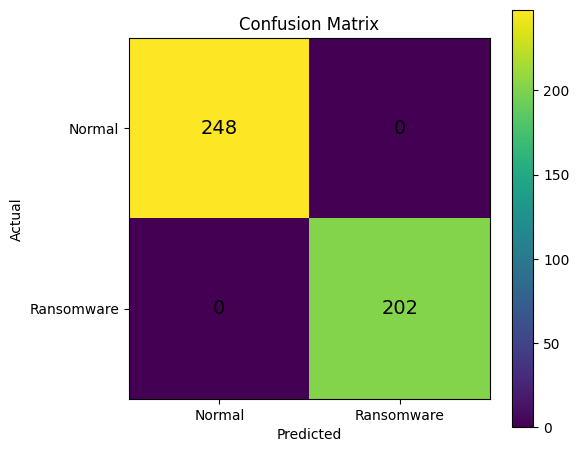

There were **no false positives and no false negatives** in the 450-sample held-out test set.

Again, these results must be interpreted together with the separability analysis rather than in isolation.

---

## 13. ROC and Precision-Recall Analysis

### ROC curve

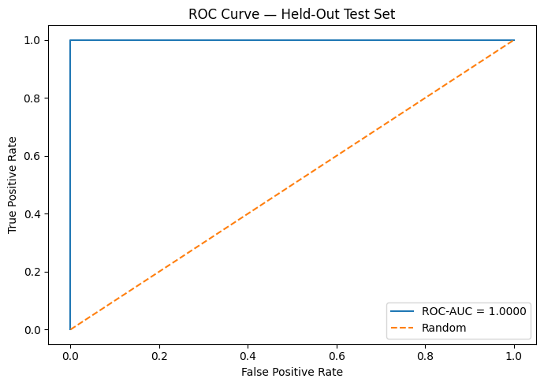

### Precision-recall curve

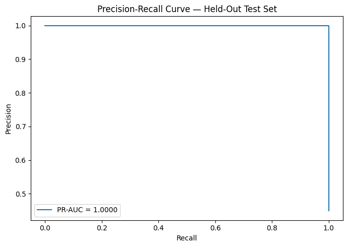

Both ROC-AUC and PR-AUC reached 1.0 on this test partition.

---

## 14. Threshold Sensitivity

The deployed probability threshold is:

```text
0.45
```

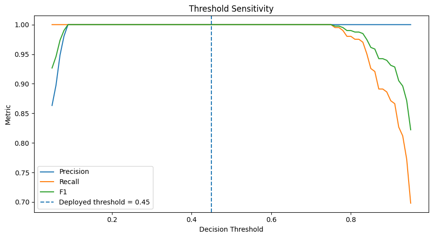

Around the deployed operating point, thresholds from approximately 0.41 through 0.50 all produced:

- Precision = 1.0
- Recall = 1.0
- F1 = 1.0
- FP = 0
- FN = 0

This wide stable interval is another consequence of the large class margin in the current dataset.

---

## 15. Error Analysis

The test-set error analysis found:

```text
Correct          450
False Positive     0
False Negative     0
```

Because there are no errors in this split, there are no difficult boundary cases to inspect. For future work, a more realistic dataset with overlapping benign and malicious conditions would make error analysis much more informative.

---

## 16. Five-Fold Stratified Cross-Validation

The neural model was additionally evaluated using five stratified folds.

| Fold | ROC-AUC | PR-AUC |
|---:|---:|---:|
| 1 | 1.0000 | 1.0000 |
| 2 | 1.0000 | 1.0000 |
| 3 | 1.0000 | 1.0000 |
| 4 | 1.0000 | 1.0000 |
| 5 | 1.0000 | 1.0000 |

**Mean CV ROC-AUC: 1.000000 ± 0.000000**

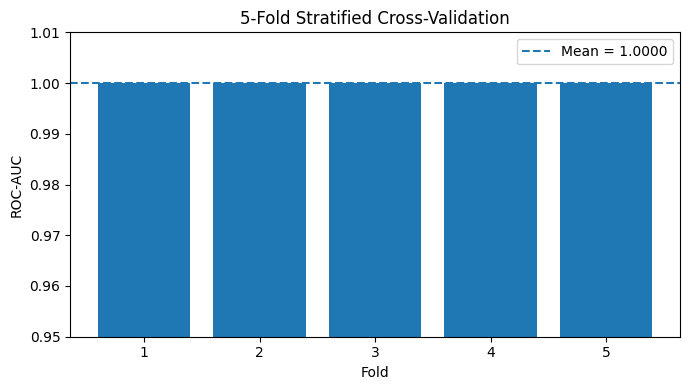

Cross-validation consistency confirms that the perfect score is reproducible across partitions of this dataset. It does **not**, however, remove the dataset-separability limitation.

---

## 17. TinyML Conversion

After training, the Keras model is converted to a **float16 TensorFlow Lite** representation.

Result:

```text
TFLite model size: 9,072 bytes ≈ 8.86 KB
```

This makes the learned classifier compact enough to be considered for resource-constrained edge deployment, subject to target-specific memory and latency validation.

---

## 18. Keras ↔ TFLite Parity Validation

The converted TFLite model is tested across the complete held-out test set.

| Parity metric | Result |
|---|---:|
| Mean absolute probability difference | 0.00046433 |
| Maximum absolute probability difference | 0.00364345 |
| Classification agreement | 1.000000 |

The float16 conversion therefore preserves the classification decisions on the test set.

---

## 19. Embedded C Export

The TFLite byte array is converted into:

```text
ransomware_model_new.h
```

The generated header contains:

- model bytes,
- model length,
- feature ordering,
- deployment threshold.

This supports integration with an embedded inference application where the TFLite model is compiled into firmware.

> Actual RAM usage, latency, flash usage, and power consumption still need to be measured on the intended target hardware before making hardware-performance claims.

---

## 20. Main Findings

### What the project successfully demonstrates

- structured hardware-telemetry preprocessing,
- systematic EDA,
- binary classification with a compact neural network,
- training-only normalization,
- regularization,
- stratified hold-out evaluation,
- ROC and PR analysis,
- confusion-matrix analysis,
- threshold analysis,
- error analysis,
- 5-fold cross-validation,
- TensorFlow Lite float16 conversion,
- full test-set Keras/TFLite parity checking,
- C-compatible model export for edge integration.

### What the current dataset does not establish

The dataset does **not** establish that the model will retain 100% performance in uncontrolled real-world environments.

Several features have non-overlapping ranges between Normal and Ransomware samples, and six individual features obtain ROC-AUC = 1.0 by themselves.

This makes the current dataset suitable for validating the **pipeline and deployment workflow**, but inadequate for demonstrating challenging real-world generalization.

---

## 21. Recommended Future Work

A stronger second-stage version of the project should introduce:

1. **Hard benign negatives**  
   High-CPU workloads, gaming, rendering, backups, large file transfers, compression and other legitimate activities that can resemble ransomware telemetry.

2. **Greater class overlap**  
   Avoid fixed non-overlapping ranges that encode the target label too directly.

3. **External validation**  
   Evaluate on telemetry collected independently from the training-data generation process.

4. **Temporal modelling**  
   Convert isolated rows into time windows and evaluate 1D CNN, TCN, LSTM or anomaly-detection approaches.

5. **Feature ablation**  
   Quantify whether multiple sensor families actually improve performance over individual signals.

6. **Target-device benchmarking**  
   Measure inference latency, RAM, flash use and power consumption on the intended embedded platform.

---

## 22. Repository Structure

A clean GitHub repository can use:

```text
Ransomeware-detection/
│
├── README.md
├── requirements.txt
├── .gitignore
│
├── notebooks/
│   └── notebook02b2a90907.ipynb
│
├── models/
│   ├── ransomware_model_new.tflite
│   └── ransomware_model_new.h
│
├── reports/
│   └── training_report.txt
│
└── assets/
    ├── 01_class_distribution.png
    ├── 02_feature_distributions.png
    ├── 03_feature_boxplots.png
    ├── 04_correlation_matrix.png
    ├── 05_pca_projection.png
    ├── 06_training_validation_loss.png
    ├── 07_training_validation_auc.png
    ├── 08_roc_curve.png
    ├── 09_precision_recall_curve.png
    ├── 10_confusion_matrix.png
    ├── 11_threshold_sensitivity.png
    └── 12_cross_validation.png
```

---

## 23. Requirements

Core Python packages used by the notebook:

```text
numpy
pandas
matplotlib
scikit-learn
tensorflow
```

Install with:

```bash
pip install -r requirements.txt
```

---

## 24. Reproducibility

The notebook uses a fixed random seed:

```text
42
```

The same seed is applied to:

- Python random,
- NumPy,
- TensorFlow,
- train/validation/test splitting,
- stratified cross-validation.

This improves reproducibility across runs, although exact floating-point behavior can still vary by TensorFlow version and hardware.

---

## 25. Responsible Interpretation

The technically correct way to present the current result is:

> **The classifier achieved perfect performance on the held-out test split and five-fold cross-validation of the current dataset. EDA revealed that several individual telemetry features almost perfectly separate the classes, so these scores primarily validate the end-to-end ML and TinyML deployment pipeline rather than prove generalization to arbitrary real-world ransomware.**

That statement preserves both the engineering achievement and the statistical limitation of the dataset.

---

## 26. Resume-Safe Project Description

**Hardware-Telemetry Ransomware Detection & TinyML Deployment**  
Developed an 8-feature hardware/system-telemetry ransomware detection pipeline with comprehensive EDA, stratified evaluation, five-fold cross-validation, threshold/error analysis and a compact TensorFlow neural classifier. Converted the trained model to float16 TensorFlow Lite (~8.86 KB) and validated Keras–TFLite prediction parity before exporting the model as a C-compatible header for embedded integration.

---

## License

Add the license appropriate for the repository and dataset usage.

